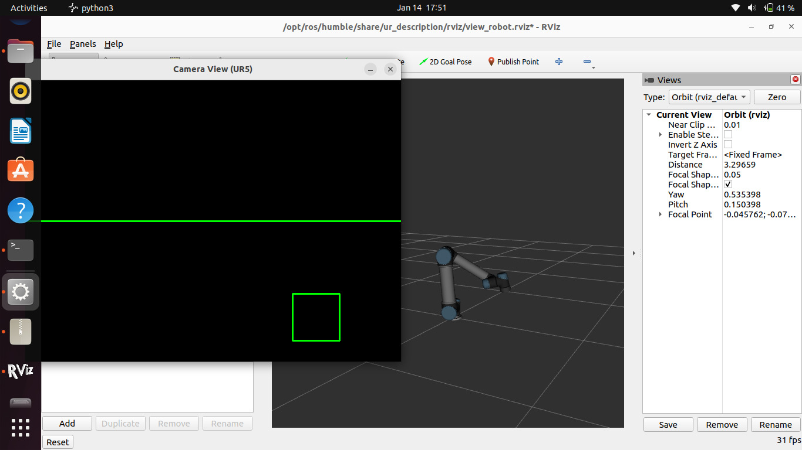
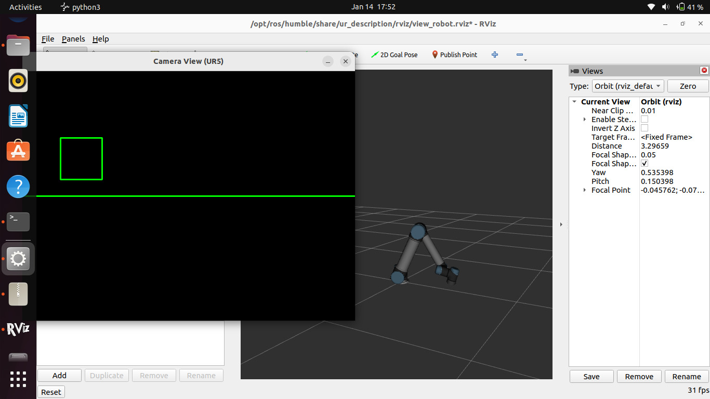

# ROS 2 Camera Click Teleoperation Interface (UR5 & Mobile Robots)
This project implements a **camera-based teleoperation interface using ROS 2 and OpenCV**.  
A live camera feed is displayed, and **mouse clicks on the image are translated into robot motion commands**.
The system supports:
- ✔️ **Webcam input** using `v4l2_camera`
- ✔️ **Mobile robots** (Turtlesim / TurtleBot-style `/cmd_vel`)
- ✔️ **Industrial robot manipulation** using **UR5 (URSim + ROS 2 Control)**
- ✔️ **Single-command launch** that starts the entire system
---
## Project Motivation
Traditional robot teleoperation relies on keyboards, joysticks, or specialized hardware.  
This project explores a **vision-based interaction paradigm**, where the user controls a robot **directly by clicking on a camera view**, making teleoperation more intuitive and accessible.

## Repository Structure
```
ros2_camera_robot_interface/
└── ros2_ws/
├── src/
│ └── camera_click_teleop/
│ ├── camera_click_teleop/
│ │ ├── click_teleop_node.py # Mobile robot teleop
│ │ ├── ur5_click_teleop_node.py # UR5 click teleop
│ │ └── init.py
│ ├── launch/
│ │ ├── click_teleop_with_v4l2.launch.py
│ │ ├── ur5_click_teleop_with_v4l2.launch.py
│ │ └── ur5_all_in_one.launch.py # One-command full system launch
│ ├── resource/
│ │ └── camera_click_teleop
│ ├── package.xml
│ ├── setup.py
│ └── setup.cfg
├── build/ # auto-generated by colcon
├── install/ # auto-generated by colcon
└── log/ # auto-generated by colcon
```
---
## Features
### Camera & Interface
- Live camera feed using **OpenCV**
- Mouse click detection
- Black control window with:
  - Green center reference line
  - Green square showing click position
### Control Logic
- Click position is compared with image center
- Motion is proportional and clearly visible
- Safety-oriented incremental motion
### Supported Robots
- **Turtlesim / Mobile robots**
  - Publishes `/cmd_vel` (`geometry_msgs/Twist`)
- **UR5 industrial robot**
  - Publishes joint trajectories
  - Uses `scaled_joint_trajectory_controller`
  - Works with **URSim (Docker)** and **ROS 2 Control**
### Launch System
- Single launch file can start:
  - URSim
  - UR ROS 2 driver
  - Camera node
  - Click teleoperation node
  - RViz visualization
---
## System Architecture Overview
**Data Flow:**
```
          Webcam
            ↓
v4l2_camera_node → /image_raw
            ↓
    OpenCV Click Interface
            ↓
    Motion Mapping Logic
            ↓
┌─────────────────────────────┐
│ Mobile Robot: /cmd_vel      │
│ UR5 Robot: JointTrajectory  │
└─────────────────────────────┘
```
---
## 📦 Dependencies
**Tested on:** Ubuntu 22.04 + ROS 2 Humble
```
sudo apt update 
```
```
sudo apt install ros-humble-desktop \
                 ros-humble-v4l2-camera \
                 ros-humble-cv-bridge \
                 ros-humble-turtlesim \
                 ros-humble-image-tools \
                 ros-humble-ur-robot-driver \
                 python3-opencv
```
Docker is required for URSim:
```
sudo apt install docker.io
sudo usermod -aG docker $USER
```
(Re-login required)
### Build Instructions
```
cd ~/ros2_camera_robot_interface/ros2_ws
source /opt/ros/humble/setup.bash
colcon build --packages-select camera_click_teleop
source install/setup.bash
```
### Running the System
Option 1: Mobile Robot / Turtlesim
```
ros2 launch camera_click_teleop click_teleop_with_v4l2.launch.py
```
This launches:
   - Webcam
   - Click teleop node
   - Turtlesim
Option 2: UR5 – One Command (Recommended)
```
ros2 launch camera_click_teleop ur5_all_in_one.launch.py
```
This automatically starts:
    - URSim (Docker)
    - UR ROS 2 driver
    - RViz
    - Camera
    - UR5 click teleop interface
Important:
After launch, open URSim in a browser:
```
http://192.168.56.101:6080/vnc.html
```
Then:
    - Power ON
    - Release brakes
    - Load External Control
    - Press Play
### Interface Behavior
Mobile Robot
```
    Click above center → move forward
    Click below center → move backward
```
UR5 Robot
```
    Click left / right → rotate base joint
    Click up / down → lift shoulder joint
    Click corners → combined motion
```
Motion is incremental, safe, and clearly visible.
### Debugging & Verification
Check camera:
```
ros2 topic echo /image_raw --once
```
Check mobile robot commands:
```
ros2 topic echo /cmd_vel
```
Check UR5 state:
```
ros2 topic echo /joint_states --once
ros2 control list_controllers
```

## Docker (Plug-and-Play)
Run URSim + ROS app in one command:
```
xhost +local:docker
docker-compose up --build

```
Open URSim:
```
http://192.168.56.101:6080/vnc.html
```

Then run External Control (Play) in PolyScope.

##  Demo Screenshots

### UR5 Click Teleoperation – Center Click

This screenshot shows the OpenCV camera interface with a click near the center of the image.  
The green square indicates the detected click position, and the green horizontal line marks the image center.


### UR5 Click Teleoperation – Upper Click

Clicking above the center line results in an upward joint motion of the UR5, visualized in RViz.


### UR5 Click Teleoperation – Lower Click

Clicking below the center line results in a downward joint motion of the UR5 robot.


### UR5 Robot Motion in RViz

This screenshot shows the UR5 robot moving in RViz as a result of camera-based click teleoperation.

---

##  Demo Video

A complete demonstration video of the system is available in the repository:
```
media/videos/DemoVideo.mp4
```

The video demonstrates:
- One-command system launch
- Camera click interaction
- Corresponding UR5 robot motion in RViz
### Current Project Status
Feature	Status
- Camera → OpenCV window	✔️
- Mouse click detection	✔️
- Mobile robot control (/cmd_vel)	✔️
- UR5 joint control	✔️
- URSim + ROS 2 Control integration	✔️
- Single-command system launch	✔️
- RViz visualization	✔️

### Contributors
    Mohammed Shehsin
    Laura de León Torres
    
### License
Academic and educational use.
